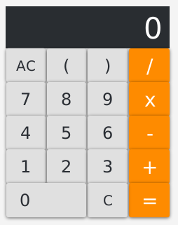

# Desktop Application

A calculator desktop application for OS X written with Clojure and JavaFX.

## Quick Usage

You need Leiningen.

```bash
$ git clone https://github.com/andrenventer/clojure-javafx
$ cd clojure-javafx
$ lein run
```

[](./screen.png?raw=true)

## Build JAR

You need Leiningen

    lein uberjar

And the built artifact is available at:

    ./target/app-0.2.0-SNAPSHOT-standalone.jar

and executable as:

    java -jar ./target/app-0.2.0-SNAPSHOT-standalone.jar

## Build for Mac

You need Leiningen Ant.

    ./build.sh

And the built artifact is available in `./dist/Calculator.app`

App Bundler used to be available from: https://java.net/projects/appbundler/downloads

## Credits

http://eddmann.com/posts/infix-calculator-in-clojure/

## License

Distributed under the Eclipse Public License either version 1.0 or (at
your option) any later version.
